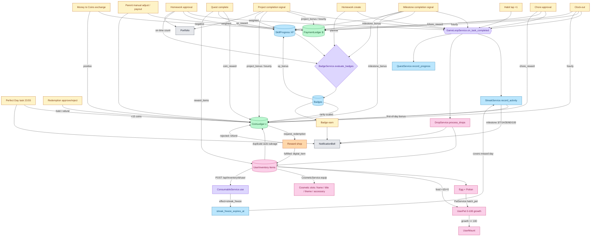

# Rewards & Achievements Inventory

A single-page reference for every "reward or achievement" surface in The Abby Project — what it is, why it exists, and every code path that awards it. Grouped by role: **Currencies → Progression → RPG loot → Engagement → Spend/convert → Display surfaces**.

## Bird's-eye view

---

## 1. Currencies (append-only ledgers)

### Money — `PaymentLedger`
**Purpose:** Real dollars that flow to Greenlight. The "job" side of the app.
**Model:** [apps/payments/models.py:7](../apps/payments/models.py) — `PaymentLedger.EntryType`
**Types:** `hourly`, `project_bonus`, `bounty_payout`, `milestone_bonus`, `materials_reimbursement`, `payout`, `adjustment`, `chore_reward`, `coin_exchange` (negative when buying coins).
**Service:** `PaymentService` extends `BaseLedgerService` — [apps/payments/services.py:11](../apps/payments/services.py)
**Paths to earn:**
- Clock-out → weekly timecard generation at [apps/timecards/services.py:218](../apps/timecards/services.py) (hourly)
- Project completion signal at [apps/projects/signals.py:61](../apps/projects/signals.py) (`project_bonus` for required, `bounty_payout` for bounty; bounty pays 2.5× multiplier)
- Milestone completion at [apps/projects/signals.py:136](../apps/projects/signals.py) (`bonus_amount` field on milestone)
- Chore approval at [apps/chores/services.py:188](../apps/chores/services.py)
- Parent payout at [apps/payments/services.py:43](../apps/payments/services.py) (negative — cash withdrawn)
- Parent manual adjust at [apps/payments/views.py:83](../apps/payments/views.py) (and MCP tool)
- Money→coins exchange approval at [apps/rewards/services.py:241](../apps/rewards/services.py) (negative — money out)
- **Homework pays no money** (intentional — school duty, not work-for-hire)

### Coins — `CoinLedger`
**Purpose:** Non-monetary progression currency for the reward shop + gamification. Decoupled from real money so parents can tune difficulty without spending more.
**Model:** [apps/rewards/models.py:7](../apps/rewards/models.py) — `CoinLedger.Reason`
**Types:** `hourly`, `project_bonus`, `bounty_bonus`, `milestone_bonus`, `badge_bonus`, `redemption` (−), `refund`, `adjustment` (catch-all: check-in bonus, perfect-day bonus, salvage, quest rewards, parent adjust), `chore_reward`, `exchange` (+ when buying with money).
**Service:** `CoinService` extends `BaseLedgerService` — [apps/rewards/services.py:28](../apps/rewards/services.py)
**Paths to earn:**
- Clock-out: `COINS_PER_HOUR × hours` (default 5/hr)
- Project/milestone/bounty completion (same signals as money) at [apps/projects/signals.py:72](../apps/projects/signals.py)
- Chore approval at [apps/chores/services.py:198](../apps/chores/services.py)
- Badge earn → `COINS_PER_BADGE_RARITY[rarity]` (common 5 → legendary 150) at [apps/achievements/services.py:274](../apps/achievements/services.py)
- Daily check-in (first activity of the day) at [apps/rpg/services.py](../apps/rpg/services.py) — `5 × min(1 + streak × 0.10, 3.0)` (5c at day 1, 15c cap at day 20+)
- Perfect Day bonus (+15) at [apps/rpg/tasks.py:40](../apps/rpg/tasks.py)
- Quest completion reward at [apps/quests/services.py:185](../apps/quests/services.py)
- Cosmetic-drop salvage (dup cosmetics auto-convert to `item.coin_value`) at [apps/rpg/services.py:141](../apps/rpg/services.py)
- Redemption refund on parent rejection at [apps/rewards/services.py:165](../apps/rewards/services.py)
- Money→coins exchange approval at [apps/rewards/services.py:249](../apps/rewards/services.py)
- Parent manual adjust (`/api/coins/adjust/`) — validates balance on negatives

---

## 2. Progression

### XP / SkillProgress
**Purpose:** Demonstrates growth in a specific skill (not a currency — never spent). Drives the skill tree UI and `skill_level_reached` badge criterion.
**Model:** [apps/achievements/models.py:96](../apps/achievements/models.py) — `SkillProgress.xp_points` + derived `level` via `XP_THRESHOLDS` (0 / 100 / 300 / 600 / 1000 / 1500 / 2500).
**Service:** `SkillService.award_xp` + `AwardService.grant` — [apps/achievements/services.py:13](../apps/achievements/services.py)
**Paths to earn:**
- Clock-out distributes `10 XP × hours` across `ProjectSkillTag.xp_weight` at [apps/timecards/services.py:126](../apps/timecards/services.py)
- Milestone completion → `MilestoneSkillTag.xp_amount` (or falls back to project XP distribution) at [apps/projects/signals.py:130](../apps/projects/signals.py)
- Homework approval distributes XP across `HomeworkSkillTag`s at [apps/homework/services.py:222](../apps/homework/services.py)
- Badge earn: `badge.xp_bonus` distributed evenly across active skills at [apps/achievements/services.py:293](../apps/achievements/services.py)
- Quest completion `xp_reward` at [apps/quests/services.py:195](../apps/quests/services.py)

### Badges
**Purpose:** Named achievement unlocks scoped to specific accomplishments. Display on `/achievements`, gate some quests, award coins + XP on earn.
**Model:** [apps/achievements/models.py:154](../apps/achievements/models.py) — `Badge.CriteriaType` (48 types)
**Criteria families:**
- *time:* `hours_worked`, `hours_in_day`, `days_worked`, `first_clock_in`, `early_bird` (before 8 AM), `late_night` (after 9 PM)
- *projects/milestones:* `projects_completed`, `first_project`, `category_projects`, `materials_under_budget`, `perfect_timecard`, `photos_uploaded`, `bounty_completed`, `milestones_completed`, `fast_project`, `co_op_project_completed`
- *skills:* `skill_level_reached`, `skills_unlocked`, `skill_categories_breadth`, `subjects_completed`, `cross_category_unlock`, `category_mastery`
- *economy:* `total_earned` (money lifetime), `total_coins_earned` (coin lifetime — ignores spends), `coins_spent_lifetime`, `savings_goal_completed`, `reward_redeemed`
- *homework:* `homework_planned_ahead`, `homework_on_time_count`
- *creations:* `creations_logged`, `creations_approved`, `creation_skill_breadth`
- *RPG progression:* `streak_days`, `perfect_days_count`, `streak_freeze_used`, `habit_max_strength`, `habit_count_at_strength`, `habit_taps_lifetime`, `chore_completions`, `quest_completed`, `boss_quests_completed`, `collection_quests_completed`, `pets_hatched`, `pet_species_owned`, `mounts_evolved`
- *journal:* `journal_entries_written`, `journal_streak_days`
- *meta:* `badges_earned_count`, `cosmetic_set_owned`, `cosmetic_full_set`, `full_potion_shelf`, `consumable_variety`, `chronicle_milestones_logged`, `grade_reached`, `birthdays_logged`

Seed "Bronze Saver" (500 coins) and "Gold Saver" (5000 coins) badges ship in [badges.yaml](../content/rpg/initial/badges.yaml) using the `total_coins_earned` criterion.
**Service:** `BadgeService.evaluate_badges` — [apps/achievements/services.py:247](../apps/achievements/services.py)
**Paths to earn (every call site that triggers re-evaluation):**
- Any `AwardService.grant` — [apps/achievements/services.py:233](../apps/achievements/services.py)
- Homework creation (planner badges — rewards filing early) at [apps/homework/services.py:129](../apps/homework/services.py)
- Homework approval (on-time count) at [apps/homework/services.py:225](../apps/homework/services.py)
- Milestone completion at [apps/projects/signals.py:144](../apps/projects/signals.py)
- Timecard approval (perfect timecard) at [apps/timecards/services.py:241](../apps/timecards/services.py)
- Quest completion at [apps/quests/services.py:202](../apps/quests/services.py)

### Habit strength (progression metric, not spendable)
**Purpose:** Self-tracked behavior color bar (red → green → blue). **Pays no coins/money** — the reward is just the visual streak and an RPG-loop tick.
**Model:** `Habit.strength` in [apps/habits/models.py](../apps/habits/models.py)
**Paths:**
- Positive tap: +1 strength (capped by `max_taps_per_day`, default 1); fires `GameLoopService.on_task_completed(user, "habit_log", ...)` → streak + drop roll
- Negative tap: −1 (uncapped)
- Daily decay toward 0 via `decay_habit_strength_task` (Celery, 00:05 local)

---

## 3. RPG loot

### Drops (ItemDefinition → UserInventory)
**Purpose:** Randomized loot pulls on task completion. The "surprise" reward layer that makes consistent engagement pay off in cosmetics/consumables.
**Model:** [apps/rpg/models.py:48](../apps/rpg/models.py)
**Item types (10):** `egg`, `potion`, `food`, `cosmetic_frame`, `cosmetic_title`, `cosmetic_theme`, `cosmetic_pet_accessory`, `quest_scroll`, `coin_pouch`, `consumable`
**Rarities (5):** common, uncommon, rare, epic, legendary
**Service:** `DropService.process_drops` — [apps/rpg/services.py:91](../apps/rpg/services.py)
**Base drop rates** (`BASE_DROP_RATES`, keyed by [`TriggerType`](../apps/rpg/constants.py)): `CLOCK_OUT` 0.40, `CHORE_COMPLETE` 0.30, `HOMEWORK_COMPLETE` 0.35, `HOMEWORK_CREATED` 0.15 (daily-capped — see below), `MILESTONE_COMPLETE` 0.80, `PROJECT_COMPLETE` 1.00, `BADGE_EARNED` 1.00, `QUEST_COMPLETE` 1.00, `PERFECT_DAY` 1.00, `HABIT_LOG` 0.15. Streak adds `+0.05/day` up to `+0.50`. The content-pack loader validates every trigger string in `drops.yaml` against this enum and raises `ContentPackError` on typos.
**Paths to earn:** Called by `GameLoopService.on_task_completed` from every activity trigger. `homework_created` beyond the first assignment of the day passes `drops_allowed=False` to suppress the roll (anti-farming cap in `HomeworkService.create_assignment`).

### Pets → Mounts
**Purpose:** Collectible companions that evolve. Long-tail goal that makes egg/potion/food drops meaningful.
**Model:** [apps/pets/models.py:64](../apps/pets/models.py) — `UserPet` (growth 0–100), `UserMount` (evolved).
**Service:** `PetService` — [apps/pets/services.py:12](../apps/pets/services.py)
**Paths:**
- **Hatch:** consume 1 egg + 1 potion (`PetService.hatch_pet`). Species × potion combo gated by `PetSpecies.available_potions` M2M.
- **Feed:** consume food → +15 growth if preferred species match, +5 neutral.
- **Evolve:** auto at `growth_points >= 100` → `UserMount` created; pet retained in stable.
- **Activate:** one active pet + one active mount per user.

### Cosmetics (4 slots)
**Purpose:** Personalization. Never consumed on equip; duplicates auto-salvage to coins.
**Slots:** `active_frame`, `active_title`, `active_theme`, `active_pet_accessory` on `CharacterProfile` (nullable FKs with `limit_choices_to`).
**Service:** `CosmeticService.equip/unequip` — [apps/rpg/services.py](../apps/rpg/services.py)
**Paths:**
- Dropped via normal drop rolls
- Duplicate of an owned cosmetic → auto-salvage to `item.coin_value` as `CoinLedger.adjustment` ([apps/rpg/services.py](../apps/rpg/services.py))

### Consumables (one-shot items)
**Purpose:** Single-use items that fire an effect and decrement inventory. Complement the cosmetics path where items stay owned on equip.
**Model:** `ItemDefinition.ItemType.CONSUMABLE` — metadata-dispatched by `ConsumableService._apply_effect`.
**Service:** `ConsumableService` — [apps/rpg/services.py](../apps/rpg/services.py)
**Endpoint:** `POST /api/inventory/<item_id>/use/`
**Currently shipped effects (14):** `streak_freeze` (one-shot grace day), `xp_boost` (timer-gated multiplier on XP awards via `xp_boost_multiplier`), `coin_boost` (timer-gated multiplier on coin earns whitelisted by `is_boostable_coin_reason`), `drop_boost` (additive bonus to drop rate via `drop_boost_additive`), `growth_tonic` (+2× growth for next N pet feeds), `rage_breaker` (clears the user's active boss-quest rage shield), `growth_surge` (+30 to active pet, daily-capped), `feast_platter` (+10 to every unevolved pet, daily-capped), `mystery_box` (random common/uncommon non-cosmetic item), `lucky_dip` (random uncommon-or-rarer cosmetic; auto-salvages dupes), `quest_reroll` (spawns an eligible system quest when the slot is empty), `morale_tonic` (longer-duration `growth_tonic` variant — distinct slug so `consumable_variety` counts both), `skill_tonic` (+N XP to the user's highest-level skill, with level-up math), `food_basket` (N random food items).
**Paths to obtain:**
- Drop rule in [content/rpg/initial/drops.yaml](../content/rpg/initial/drops.yaml) — rarely from milestone/project/badge/perfect triggers
- Purchase from reward shop — seeded in [content/rpg/initial/rewards.yaml](../content/rpg/initial/rewards.yaml), `fulfillment_kind: digital_item` (credits the item on approve)
**Adding a new consumable:** add YAML entry with `item_type: consumable` + `metadata.effect: <slug>`, then add the matching branch in `_apply_effect`. Unknown effects raise `ValueError` so a YAML typo doesn't silently no-op.

### Quests (boss + collection)
**Purpose:** Time-boxed, opt-in goals with bundled rewards. Gated by badges for late-game content.
**Model:** [apps/quests/models.py](../apps/quests/models.py) — `Quest.quest_type` = `boss` (HP pool) or `collection` (item count).
**Damage table** (`TRIGGER_DAMAGE` in [apps/quests/services.py](../apps/quests/services.py), keyed by `TriggerType`): clock_out 10/hr, chore 15, homework_complete 25, homework_created 5, milestone 50, badge 30, project_complete 75, habit_log 5. `QUEST_COMPLETE` and `PERFECT_DAY` are intentionally absent — they're rewards, not damage sources.
**Filter knobs:** `QuestDefinition.trigger_filter` JSON (validated by [apps/quests/validators.py](../apps/quests/validators.py)) — `allowed_triggers` (must be valid `TriggerType` values), `project_id`, `skill_category_id`, `chore_ids`, `savings_goal_id`, `on_time` (only counts on-time/early homework). Unknown keys or trigger values raise `ValidationError` in model `clean()`, `QuestWriteSerializer`, and the MCP `create_quest_definition` tool — a typo like `allowed_trigger` (missing `s`) no longer silently accepts every trigger. The 2026-04-23 review removed `streak_target` and `perfect_day_target` from the allowlist — they were validated but never read; re-add only when a reader lands in `QuestService.record_progress`.
**Paths:**
- Progress: `QuestService.record_progress` called from `GameLoopService.on_task_completed` at [apps/rpg/services.py](../apps/rpg/services.py)
- On complete: coins (`coin_reward`) + XP (`xp_reward` via `AwardService.grant` → triggers `quest_completed` badge check) + any `QuestRewardItem` entries added to `UserInventory`
- **Rage shield:** `apply_boss_rage_task` (Celery 00:15) ticks every active boss quest — idle day climbs by `RAGE_SHIELD_STEP` (20) capped at `RAGE_SHIELD_CAP` (100); active day decays by 20 toward 0. Returns `{"raged": int, "decayed": int}`. The decay-on-return path aligns with the gentle-nudge doctrine: absence costs progress, return clears the penalty.
- **Expiry:** `expire_quests_task` (Celery 00:10) marks past-due active quests as expired (no rewards)

---

## 4. Engagement events (daily rhythm)

### Login streak + daily check-in
**Purpose:** Rewards consistency; drives return visits.
**Model:** `CharacterProfile.login_streak` + `longest_login_streak` — [apps/rpg/models.py:16](../apps/rpg/models.py)
**Paths:**
- `StreakService.record_activity` called from `GameLoopService.on_task_completed` on every trigger ([apps/rpg/services.py](../apps/rpg/services.py))
- First activity of day awards streak-scaled coin bonus: `5 × min(1 + streak × 0.10, 3.0)` (day 1 = 5c, day 20+ = 15c cap)
- Milestone notifications at streaks of **3 / 7 / 14 / 30 / 60 / 100** days
- Gap > 1 day resets streak to 1 (flame dims — no coin/XP/item loss) **unless a Streak Freeze is armed** (see Consumables) — in that case the streak survives and the freeze is consumed. Result dict gains `freeze_consumed: true` when this happens.

### Perfect Day
**Purpose:** Rewards fully completing a day's chores while staying active.
**Paths:**
- `evaluate_perfect_day_task` Celery at 23:55 local ([apps/rpg/tasks.py:10](../apps/rpg/tasks.py)) — if active today AND every daily chore approved: `perfect_days_count += 1`, +15 coins, `perfect_day` notification, triggers a `perfect_day` drop roll (base rate 1.00)

---

## 5. Spend / convert mechanisms

### Reward shop (Coins → real-world or digital items)
**Purpose:** The end-of-funnel spend. Gives coins somewhere to land.
**Model:** `Reward`, `RewardRedemption` ([apps/rewards/models.py:50](../apps/rewards/models.py))
**Fulfillment:** `real_world` (parent delivers), `digital_item` (auto-credit ItemDefinition to inventory on approve), `both`
**Flow:**
1. Child requests → `RewardService.request_redemption` at [apps/rewards/services.py:79](../apps/rewards/services.py) — coins immediately **held** (spent into a pending row)
2. Parent approves → `fulfilled`, digital item (if any) credited to `UserInventory`
3. Parent rejects → `refund` reason on `CoinLedger`, stock restored

### Money → Coins exchange
**Purpose:** Child can turn earned money into coins at rate `COINS_PER_DOLLAR` (default 10).
**Flow:** `ExchangeService.request_exchange` → parent approval → atomic debit `PaymentLedger` (`coin_exchange`, negative) + credit `CoinLedger` (`exchange`, positive). Balance is **not held** at request time; re-verified at approval.

---

## 6. Display surfaces (not rewards, but where rewards show up)

### Notifications
Every achievement event fires a `Notification` row. Achievement-specific types: `badge_earned`, `streak_milestone`, `perfect_day`, `daily_check_in`, `redemption_requested`, `exchange_approved` / `exchange_denied`, plus approval-flow notifications (`chore_approved`, `homework_approved`, etc.). Rendered via `NotificationBell` in the header.

### Portfolio
`ProjectPhoto` and `HomeworkProof` images from approved work surface on `/portfolio`. No reward is issued for the display itself — it's a showcase of output.

---

## The spine that ties it all together

**`GameLoopService.on_task_completed(user, trigger_type, context)`** — [apps/rpg/services.py](../apps/rpg/services.py) — is called from every completion hook (clock-out, chore approval, project/milestone signals, homework create + approval, habit taps). It runs:

1. `StreakService.record_activity` → streak update + daily check-in coin bonus
2. `DropService.process_drops` → roll for loot (unless `context["drops_allowed"]=False`)
3. `QuestService.record_progress` → apply damage/collection to active quest if trigger matches its filter

Quest-progress failures are wrapped in `try/except` so a quest bug never breaks the parent flow. **This is the hook to extend when adding a new reward type.**
